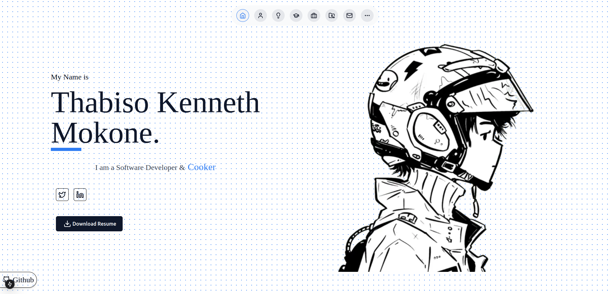

# 🌐 Thabiso Mokone – Developer Portfolio



Welcome — this repository contains my personal developer portfolio built with Next.js and Tailwind CSS. It's a working showcase of features I use daily (blog, MDX, animations, responsive UI, and theme persistence).

---

## Badges

- Built with Next.js and Tailwind CSS
- Node: `18` (see `.nvmrc`)

---

## 🔧 Getting Started

Prerequisites

- Node.js 18 (or match `.nvmrc`)
- pnpm (preferred package manager)

Quick start

```bash
# clone
git clone https://github.com/mokone-september/portfolio.git
cd portfolio

# install
pnpm install

# development
pnpm dev

# build (production)
pnpm build
pnpm start

# lint
pnpm run lint
```

Open `http://localhost:3000` after running `pnpm dev`.

---

## 🚀 Tech Stack

- Framework: Next.js (App Router)
- Language: TypeScript
- Styling: Tailwind CSS
- Animations: Framer Motion
- MDX: `@mdx-js/mdx` for blog posts

---

## ✨ Implemented Features

- Blog section (MDX-based posts) — `src/content/mdx`
- Mobile-first responsive layout across the site
- Framer Motion entry/hover animations and wrappers
- Light/Dark theme with persistence (localStorage + before-hydrate script)
- Reusable UI components (`src/components/ui`): button variants, badges, etc.

---

## 📁 Folder Overview

- `app/` — Next.js App Router pages and layout
- `src/components/` — UI and animation components
- `src/content/` — MDX blog posts
- `public/` — images and static assets

---

## 🛠 Scripts (package.json)

- `pnpm dev` — start dev server
- `pnpm build` — production build
- `pnpm start` — run built app
- `pnpm run lint` — run eslint

---

## 🤝 Contributing

If you'd like to contribute or run locally, please:

1. Fork the repo and create a branch
2. Run `pnpm install` and `npx ultracite fix` to apply formatting
3. Open a PR with a concise description of the change

Code style

- Run `npx ultracite fix` to auto-fix formatting issues (Biome/Ultracite in this project)

---

## 🖼 Preview

The repository includes `public/og-image.png` which is used as a preview in this README.

---

## 🗺️ Roadmap

- Add blog section (done)
- Mobile-first design (done)
- Add animations with Framer Motion (done)
- Add light/dark mode persistence (done)
- Multi-language support (planned)

---

## 📬 Contact

- Email: [mokoneseptember@gmail.com](mailto:mokoneseptember@gmail.com)
- LinkedIn: https://www.linkedin.com/in/mokone-september

Built with ❤️ — feel free to open an issue or PR with suggestions.
