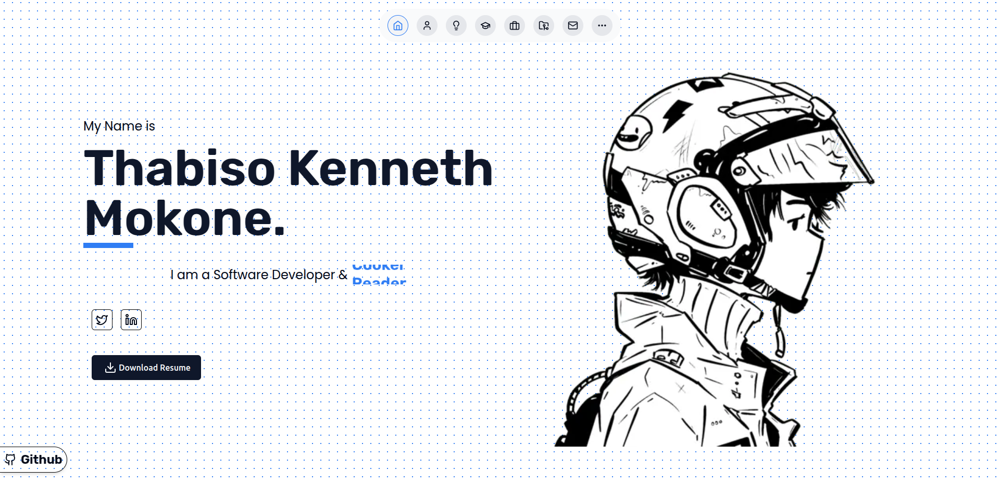

# 🌐 Thabiso Mokone – Developer Portfolio



Welcome to my personal developer portfolio, built to showcase my skills, projects, and growth as a front-end engineer. This site is a living document of my journey, updated as I learn and build more.

## 🚀 Tech Stack

- **Framework**: Next.js (App Router)
- **Language**: TypeScript
- **Styling**: Tailwind CSS
- **State Management**: React Context API
- **Deployment**: Vercel
- **Tooling**: ESLint, Prettier, Git

## 🧠 Features

- Responsive layout optimized for all screen sizes
- Interactive project cards with live previews
- Blog section with articles and tutorials
- Contact form with form validation
- SEO best practices for visibility

## 📁 Folder Structure

- `app` - Contains the main application pages and layout.
- `components` - Reusable UI components.
- `styles` - Global and component-specific styles.
- `public` - Static assets like images and PDFs.
- `utils` - Utility functions and helpers.

## 🔧 Getting Started

```bash
# Clone the repository
git clone https://github.com/mokone-september/portfolio.git

# Navigate to the project directory
cd portfolio

# Install dependencies
pnpm install

# Start the development server
pnpm dev
```

Open [http://localhost:3000](http://localhost:3000) to view in the browser.

## 🗺️ Roadmap

- Add blog section
- Mobile-first design
- Add animations with Framer Motion
- Add light/dark mode persistence
- Multi-language support

## 📬 Contact

- **Email**: mokoneseptember@gmail.com
- **LinkedIn**: [linkedin.com/in/mokone-september](https://www.linkedin.com/in/mokone-september)

Built with ❤️ and a vision to grow. Let’s connect and build the future together.
